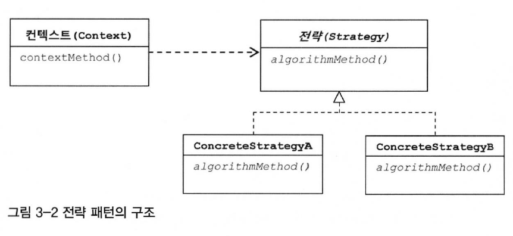
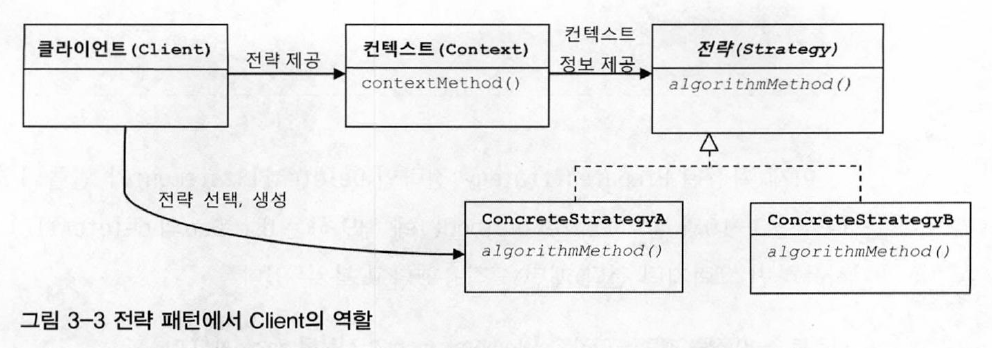

# 3장 템플릿

## 변하는 것, 변하지 않는 것
```java
public void deleteAll() throws SQLException {
    Connection c = null;
    PreparedStatement ps = null;

    try {
        c = dataSource.getConnection();

        ps = c.prepareStatement("delete from users"); // 변하는 부분

        ps.executeUpdate();
    } catch(SQLException e) {
        System.out.println(e.getMessage());
        throw e;
    } finally {
        if (ps != null) {
            try {
                ps.close();
            } catch(SQLException e) {
                System.out.println(e.getMessage());
                throw e;
            }
        }

        if (c != null) {
            try {
                c.close();
            } catch(SQLException e) {
                System.out.println(e.getMessage());
                throw e;
            }
        }
    }
}
```
위 코드를 보면 머리가 어질어질하다. try/catch/finally 블록이 상당히 복잡하고 심지어는 try/catch/finally 블록이 2중으로 중첩까지 되어 나온다. <br />
이런 메서드가 하나뿐이라면 괜찮겠지만 UserDao add, get, deleteAll, getCount 등등 많은 메서드가 비슷한 형태의 코드를 반복한다. 심지어 나중에 PostDao, CommentDao 등등 여러 Dao들이 추가되면 더 복잡할 것이다.

개발자는 중복된 코드를 굉장히 싫어한다. 더군다나 이렇게 더럽게 반복되는 코드를 좋아하는 개발자는 없을 것이다. 그렇다면 어떻게 해결해야 할까???

## 템플릿 메소드 패턴
템플릿 메소드 패턴은 변하지 않는 기능은 슈퍼클래스에 만들어두고 자주 변경되며 확장할 기능은 서브클래스에서 만들도록 한다.


## 전략 패턴
전략 패턴은 템플릿 메소드 패턴과 유사하지만 템플릿 메서드 패턴보다 유연하고 확장성이 뛰어난 패턴이다. <br />
오브젝트를 아예 둘로 분리하고 클래스 레벨에서는 인터페이스를 통해서만 의존하도록 만드는 패턴이다. 



```java
public interface StatementStrategy {
    PreparedStatement makePreparedStatement(Connection c) throws SQLException;
}
```

```java
public class DeleteAllStatement implements StatementStrategy {
    public PreparedStatement makePreparedStatement(Connection c) throws SQLException {
        PreparedStatement ps = c.prepareStatement("delete from users");
        return ps;
    }
}
```

```java
public void deleteAll() throws SQLException {
    Connection c = null;
    PreparedStatement ps = null;

    try {
        c = dataSource.getConnection();

        StatementStrategy strategy = new DeleteAllStatement();
        ps = strategy.makePreparedStatement(c);

        ps.executeUpdate();
    } catch(SQLException e) {
        System.out.println(e.getMessage());
        throw e;
    } finally {
        if (ps != null) {
            try {
                ps.close();
            } catch(SQLException e) {
                System.out.println(e.getMessage());
                throw e;
            }
        }

        if (c != null) {
            try {
                c.close();
            } catch(SQLException e) {
                System.out.println(e.getMessage());
                throw e;
            }
        }
    }
}
```

## DI적용을 위한 클라이언트/컨텍스트 분리
전략 패턴에 따르면 Context가 어떤 전략을 사용하게 할 것인가는 Context를 사용하는 앞단의 Client가 결정하는게 일반적이다.



```java
public void jdbcContextWithStatementStrategy(StatementStrategy stmt) throws SQLException {
    Connection c = null;
    PreparedStatement ps = null;

    try {
        c = dataSource.getConnection();

        ps = stmt.makePreparedStatement(c);

        ps.executeUpdate();
    } catch(SQLException e) {
        System.out.println(e.getMessage());
        throw e;
    } finally {
        if (ps != null) {
            try {
                ps.close();
            } catch(SQLException e) {
                System.out.println(e.getMessage());
                throw e;
            }
        }

        if (c != null) {
            try {
                c.close();
            } catch(SQLException e) {
                System.out.println(e.getMessage());
                throw e;
            }
        }
    }
}
```

```java
public void deleteAll() throws SQLException {
    StatementStrategy st = new DeleteAllStatement();
    jdbcContextWithStatementStrategy();
}
```

## 컨텍스트와 DI

```java
public class JdbcContext {
    private DataSource dataSource;

    public JdbcContext(DataSource dataSource) {
        this.dataSource = dataSource;
    }

    public void workWithStatementStrategy(StatementStrategy stmt) throws SQLException {
        Connection c = null;
        PreparedStatement ps = null;

        try {
            c = dataSource.getConnection();

            ps = stmt.makePreparedStatement(c);

            ps.executeUpdate();
        } catch (SQLException e) {
            throw e;
        } finally {
            if (ps != null) {
                try {
                    ps.close();
                } catch (SQLException e) {
                }
            }
            if (c != null) {
                try {
                    c.close();
                } catch (SQLException e) {
                }
            }
        }
    }
}
```

```java
public class UserDao {
    private JdbcContext jdbcContext;

    public UserDao(JdbcContext jdbcContext) {
        this.jdbcContext = jdbcContext;
    }

    public void deleteAll() throws SQLException {
        jdbcContext.workWithStatementStrategy(
            (c) -> c.prepareStatement("delete from users")));
    }
}
```

