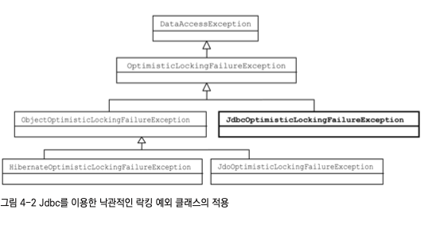

# 예외

## 사라진 SQLException
```java
public void deleteAll() throw SQLException{
    jdbcContext.executeSql("delete from users");
}
```

```java
public void deleteAll() {
    jdbcTemplate.update("delete from users");
}
```

## 복구할 수 있는 상황에서는 검사 예외를, 프로그래밍 오류에는 런타임 예외를 사용하라
자바는 문제 상황을 알리는 타입(throwable)으로 검사 예외, 런타임 예외, 에러 세 가지를 제공한다.
그렇다면 과연 언제 검사 예외와 비검사 예외를 사용해야 하는가? 
**호출하는 쪽에서 복구하리라 여겨지는 상황이라면 검사 예외를 사용하라.** <br/>
**프로그래밍 오류를 나타낼 때는 비검사 예외를 사용하자.** <br/>

더 자세한 내용은 이펙티브 자바[아이템70]참고

## 예외처리 방법
1. 예외 복구
2. 예외처리 회피
3. 예외 전환

## 예외 전환
```java
catch(SQLException e) {
    throw new DuplicateUserIdException(e);
}
```

## DAO 인터페이스

```java
public interface UserDao {
    void add(User user); // 이렇게 선언하는 것이 과연 가능할까?
}
```

## DataAccessException 계층구조


## 기술에 독립적인 UserDao 만들기
```java
public interface UserDao {
    void add(User user);
    User get(String id);
    List<User> getAll();
    void deleteAll();
    int getCount();
}
```

```java
public class UserDaoJdbc implements UserDao {
    ...
}
```